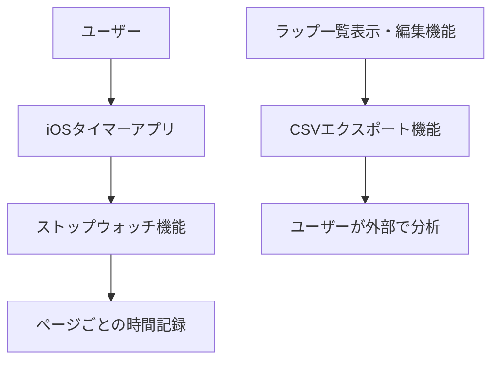
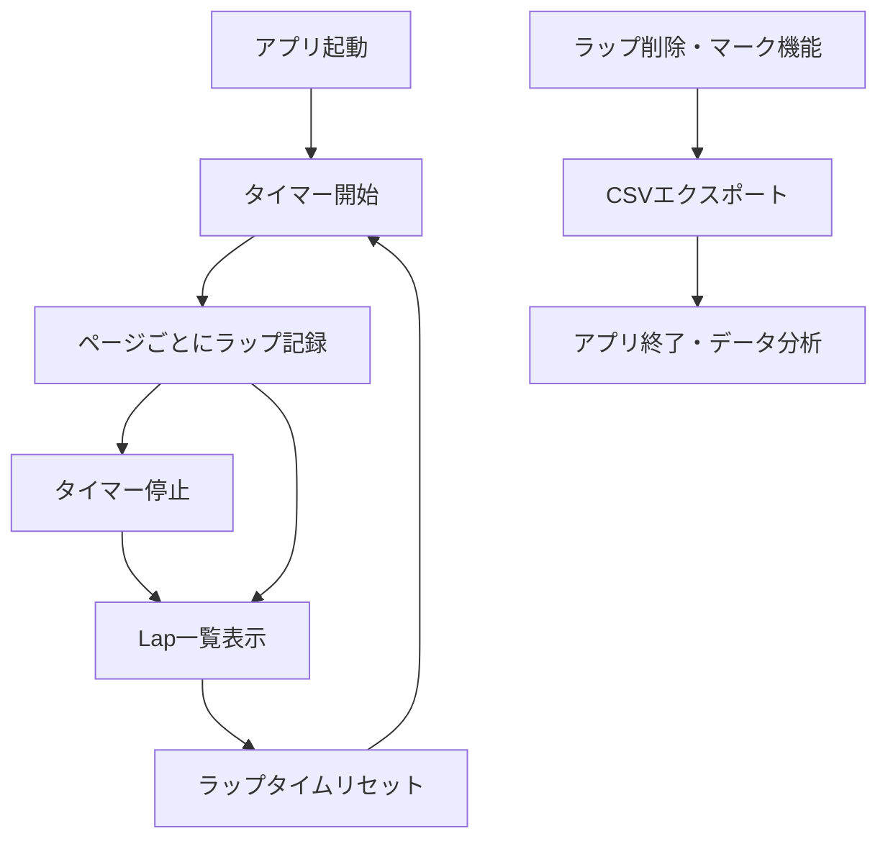

# 📄 プロジェクト仕様書（スクロール対応版）

## 1. 背景と目的

- **プロジェクトの概要：**  
  本アプリケーションは、ユーザーが読書時にページごとの読書速度を計測し、記録をCSV形式でエクスポートできるタイマーアプリです。iPhone標準のストップウォッチにはラップタイム記録機能はあるものの、記録データをエクスポートする機能が存在せず、後で分析が困難でした。本アプリはこれらの課題を解決し、ユーザーの読書効率向上を目的に開発します。

- **対象ユーザー：**
  - 資格取得や自己啓発のため日常的に読書を行い、自分の読書速度や効率を分析したいと考えるユーザー
  - 普段からスマートフォン（iPhone）を利用し、簡単に計測・記録したいユーザー

## 2. システムアーキテクチャ

## 3. 機能要件

### 3.1 タイマー計測機能
- **機能概要：** ページごとの読書時間を計測し、記録する。
- **詳細説明：**  
  - タイマーの開始・一時停止・停止機能を提供する。
  - ページごとにラップタイム（所要時間）を計測できる。
  - タイマー表示は「分:秒.コンマ秒」(mm:ss.ff)形式で表示する。
  - 最新のラップタイムをタイマー表示の下に表示する（iPhone標準のストップウォッチと同様）。

### 3.2 ラップタイム表示・編集機能（スクロール対応）
- **機能概要：**  
  計測したラップタイムはリアルタイムに一覧で表示される。ユーザーは間違えたラップを一覧画面で削除、またはマークをつけて管理できる。

- **詳細説明：**
  - ラップタイム一覧は **スクロール可能なリスト表示** となる。
  - 削除済みのラップは **フォントサイズを小さくし、通常のラップとは視覚的に区別する。**
  - 各ラップタイムの横に「削除」「マーク」ボタンを配置。
  - **「削除」「マーク」は横並び or 2段組みで枠内に収まるレイアウトとする。**
  - ユーザーは不要なラップを削除できるほか、間違えたラップには「誤記録マーク（❌など）」をつけて識別可能。
  - 削除・マーク処理をしても、他のラップタイムへの影響はない。
  - 時間表示は「分:秒.コンマ秒」(mm:ss.ff)形式で統一する。
  - 時間表示にはモノスペースフォントを使用し、数字の位置を揃える。
  - ラップタイムの一括リセット機能を提供する。
    - リセット前に確認ダイアログを表示する。
    - リセット後はすべてのラップタイムが削除される。
    - リセット操作は取り消し不可とする。
    - リセット後はラップ番号を1から再開する。
    - リセット後はタイマーを停止し、経過時間を0にリセットする。

### 3.3 CSVエクスポート機能
- **機能概要：**  
  ラップタイム一覧をCSVファイルで出力する。  
- **詳細説明：**  
  CSVファイルは日付やページ番号、読書時間、誤記録マークの有無を含む形式とする。

## 4. ユーザーフロー

## 5. 非機能要件
- **対応デバイス：** iOS 17以降を搭載したiPhone端末
- **パフォーマンス要件：**  
  - ラップタイム記録の応答速度は1秒以内
  - ラップタイムは最低100件連続で記録しても遅延しないこと
- **セキュリティ要件：**  
  - データは端末内にのみ保存される（外部サーバーには送信しない）
- **UI/UX要件：**  
  - シンプルで直感的なUI。計測中にワンタップでラップを記録できる
  - 記録一覧画面ではラップの削除やマーク付けが簡単にできる操作性
  - **ラップ一覧画面はスクロール可能なリストで設計**
  - 時間表示は「分:秒.コンマ秒」形式で統一し、モノスペースフォントで表示
  - リセット機能は誤操作防止のため確認ダイアログを表示する
- **アクセシビリティ要件：**  
  - VoiceOverなどのアクセシビリティ機能をサポート
  - 大きめの文字サイズでも表示崩れがないこと

## 6. 制約事項
- **技術的制約：** Swift, SwiftUIを用いたiOSアプリ開発
- **環境制約：** 開発環境はXcode、端末はiOS17以上の環境を前提とする
- **その他の制約：** CSV以外のフォーマット（PDF等）へのエクスポートは初期段階では提供しない

## 7. 参考資料
- **用語集：**  
  - ラップタイム：ページごとの読書所要時間  
  - CSVエクスポート：計測結果を分析可能なファイルとして出力する機能

- **参考資料：**
  - [iPhone標準のストップウォッチ - Appleサポート](https://support.apple.com/ja-jp/guide/iphone/iph96b9fdf6/ios)
  - [Apple Developer公式ドキュメント（SwiftUI）](https://developer.apple.com/documentation)
